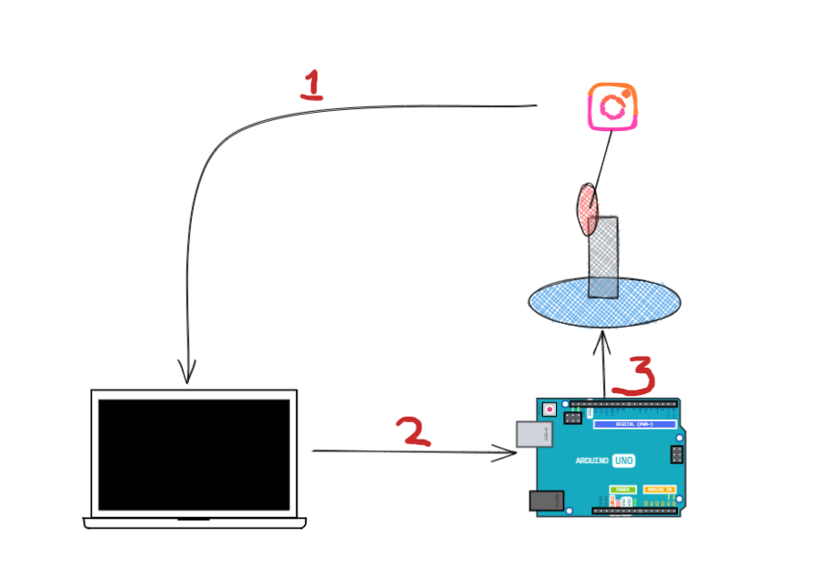
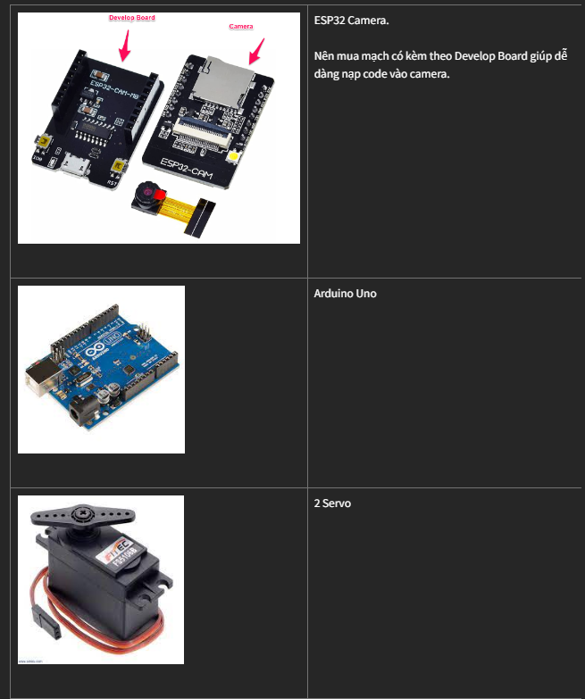

# DIY Face Tracking Camera


## 1. Nguyên lý



> <h3>①</h3> Hình ảnh được PC lấy từ webcam thông qua Wifi. Sau đó nhận diện vị trí khuôn mặt.

> <h3>②</h3> Tùy vào vị trí khuôn mặt trong khung hình so với trung tâm bức ảnh, PC gửi tín hiệu di chuyển qua trái, phải, lên, xuống qua Arduino thông qua kết nối USB

> <h3>③</h3> Arduino sẽ gửi tín hiệu tới các Servo tương ứng.

## 2. Devices


## 3. Program

### 3.1 ESP32 Camera

Làm theo hướng dẫn sau để nạp chương trình cho ESP32 Cam.

https://htpro.vn/news/tu-hoc-avr-arduino/huong-dan-su-dung-module-esp32-camera-17.html

### 3.2 Face Detection tại PC
PC có nhiệm vụ request tới Camera, xác định vị trí khuôn mặt, sau đó gửi tín hiệu di chuyển Servo tới Arduino.

Code sẽ được Run tại PC, gồm 3 functions chính :
- **face_detection** : Nhận diện khuôn mặt và vị trí khuôn mặt
- **movement** : Dựa vào tọa độ khuôn mặt so với trung tâm bức hình, quyết định các servo cần di chuyển qua trái, phải hay lên xuống
- **send_comment** : Gửi tín hiệu điều khiển từ PC với Arduino thông qua kết nối USB.

#### Face Detection 
- Language : `Python`
- Lib : `OpenCV`

Chi tiết các bạn có thể tham khảo thêm tại : 
https://towardsdatascience.com/face-detection-in-2-minutes-using-opencv-python-90f89d7c0f81


*Code xử lý nhận diện khuôn mặt và di chuyển servo*
```commandline
# 1. Define camera url, arduino port 
CAM_URL ='http://192.168.43.13/capture?'
ARDUINO_PORT = 'COM7'
...


# 2. Định nghĩa kí tự điều khiển sử dụng truyền qua Arduino 
LEFT = '4'
RIGHT = '3'
UP = '1'
DOWN = '2'

def movement(x, y):
    # Tọa độ trung tâm của bức hình. Thay đổi sao cho phù hợp với độ phân giải camera của các bạn
    x_mid, y_mid = 120, 130

    if (x > x_mid-20) and (x < x_mid + 20):
        lr = None
    else:
        lr = RIGHT if x < x_mid else LEFT

    if (y > y_mid-20) and (y < y_mid + 20):
        upd = None
    else:
        upd = DOWN if y < y_mid else UP

    return lr, upd


def face_detection(img):
    gray = cv.cvtColor(img, cv.COLOR_BGR2GRAY)
    faces = face_cascade.detectMultiScale(gray, 1.1, 2)
    # Draw rectangle around the faces

    for (x, y, w, h) in faces:
        cv.rectangle(img, (x, y), (x + w, y + h), (255, 0, 0), 1)

        lr, upd = movement(x, y)
        return img, lr, upd

    return img, None, None
```

PC và Arduino được kết nối thông qua cổng USB. Python có thể sử dụng function sau để gửi tín hiệu tới Arduino
```commandline
def send_command(cmd):
    serialPort.write(cmd.encode('ascii'))
```

**Lưu ý**:
1. Thay đổi URL của camera và port Arduino tương ứng.
2. Tùy độ phân giải của camera mà tọa độ vị trí trung tâm bức hình sẽ khác nhau. Vì vậy các bạn thay thế `x_mid, y_mid = 120, 130` phù hợp với bức hình của các bạn
3. Full code tham khảo tại ./pc/face_detection.py

**Run code** 
```commandline
python face_detection.py
```


### 3.3 Arduino 
Aruino nhận tín hiệu từ PC, sau đó gửi tín hiệu tới các Servo.

```commandline
#include<Servo.h>

Servo lr_servo;
Servo upd_servo;

# Đơn vị mỗi lần servo di chuyển. 
const int MOVE_SPEED =1; 

# Vị trí ban đầu của servo
int upd_servo_loc=10;
int lr_servo_loc=105;

..

void setup() {
...
}

void loop() {
  if (Serial.available()){
    switch (Serial.read()){
      case '1': up();
                break;
      case '2': down();
                break;
      case '3': left();
                break;
      case '4': right();
                break;
      default: break;
    }
  }
}
```

