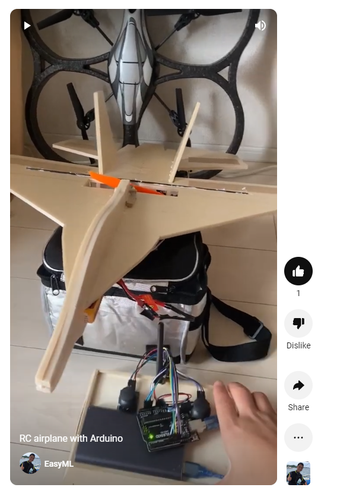
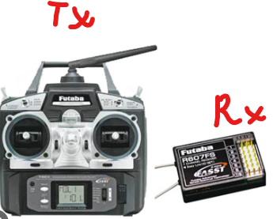
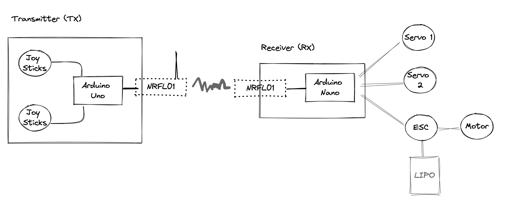
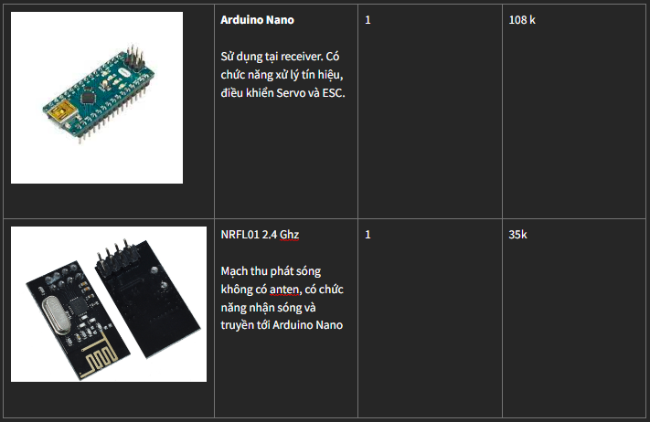
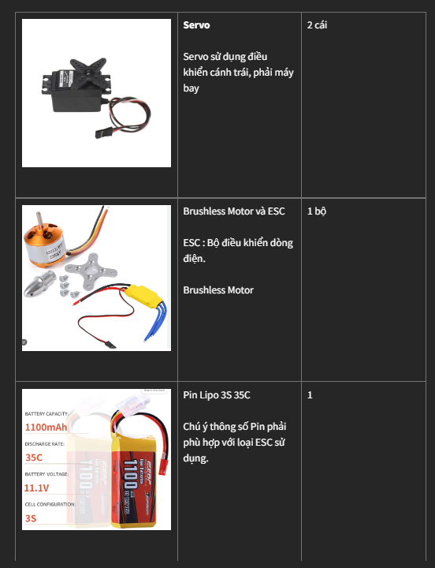
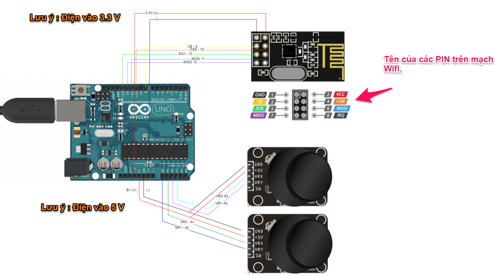
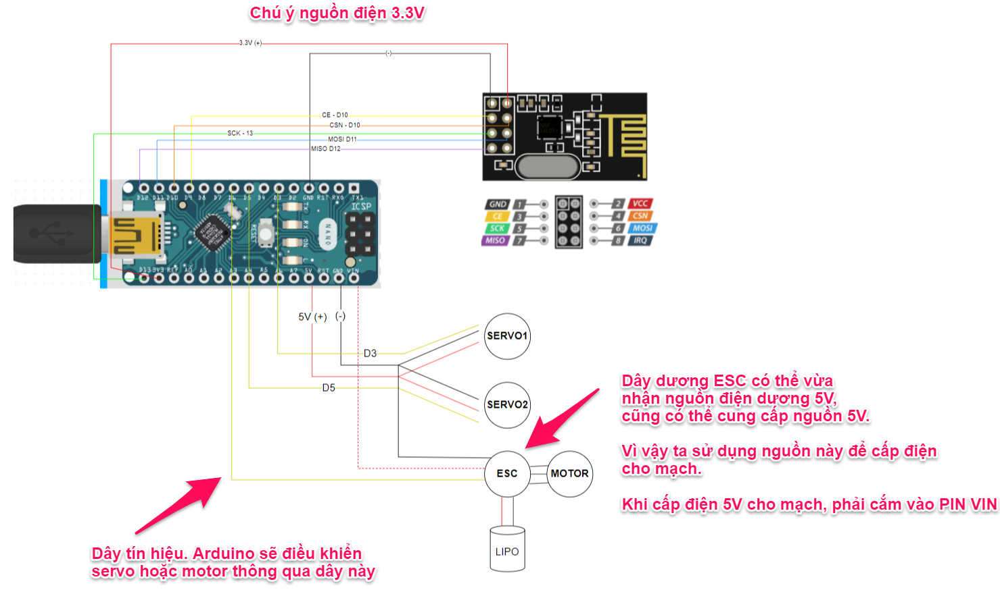

# DIY RC Airplane

*Projects hướng dẫn DIY một chiếc máy bay hoàn chỉnh từ A-Z*



https://www.youtube.com/shorts/XCcPUDrcOQ8

# 1. Nguyên lý và thiết bị

Để điều khiển máy bay, bộ điều khiển cần 2 thiết bị gồm : 
- Transmitter (TX) : Bộ phát sóng, là thiết bị sử dụng điều khiển máy bay.
- Receiver (RX) : Bộ thu sóng đặt trên máy bay. 



Bài viết này mình sẽ hướng dẫn tạo bộ Transmitter và Receiver với Arduino.

## 1.1 Nguyên lý 



- **TX** : Gồm 2 Joy sticks (Núm điều khiển), tín hiệu sẽ được truyền từ Joy Sticks tới Arduino, từ Arduino sẽ truyền thông tin qua mạch Wifi.
- **RX** : Nhận sóng truyền tới, xử lý tại mạch Arduino Nano, sau đó truyền tín hiệu tới Servo, Motor

## 2.2 Thiết bị

**Thiết bị cần cho Transmitter**


**Thiết bị cần cho Receiver**



**Thiết bị điện cho máy bay**




# 2. Nối mạch điện 

## 2.1 Transmitter

*Lưu ý*:
- Mạch wifi sử dụng nguồn 3.3V. Chú ý sử dụng đúng nguồn 3.3V
- Joy stick sử dụng nguồn 5V. 
- Mạch Arduino có thể dùng nguồn 3.3V lấy từ cục xạc dự phòng



## 2.2 Receiver


# 3. Lập trình
Tham khảo bài viết tại đây để biết cách nạp chương trình cho mạch

http://arduino.vn/bai-viet/402-huong-dan-nap-chuong-trinh-don-gian-cho-arduino-uno-r3

## 3.1 Lập trình cho TX

### 3.1 Xử lý tín hiệu từ Joy Stick

Trên TX gồm 2 Joy Stick, 1 joy stick dùng điều khiển tốc độ máy bay, joy stick còn lại dùng để lái qua trái phải. 

Mỗi joy stick lại chứa thông tin (x, y) được lưu trữ thông qua biến `JoyStick`. Cả 2 Joy Stick sẽ được lưu vào biến `Data` và được gửi liên tục qua RX. 

*Lưu ý với Joy Stick*
- Joy Stick truyền tín hiệu Analog, vì vậy cần sử dụng Port A0 - A5 trên mạch Arduino.
- 1 Joy Stick gửi 2 tín hiệu tương ứng trục X và Y, với Joy Stick 1 ta dùng cổng A0 - A1, Joy Stick 2 dùng A3 và A4
- Joy Stick trả về giá trị từ 0 - 1024, khi ở vị trí thấp nhất, giá trị ta nhận được là 0 và khi ở vị trí cao nhất, ta nhận được giá trị 1024


```
// Định nghĩa port sử dụng nhận tín hiệu từ Joy Stick
#define STICK1_X  A0 // Arduino pin connected to VRX pin
#define STICK1_Y  A1 // Arduino pin connected to VRY pin

#define STICK2_X  A2 // Arduino pin connected to VRX pin
#define STICK2_Y  A3 // Arduino pin connected to VRY pin

// Tạo stuck lưu thông tin của 1 joy stick
struct JoyStick{
  byte x;
  byte y;
};


// Function nhận tín hiệu từ Joy Stick, lưu vào biến stick
JoyStick read_joy_stick(int stick_num){

  struct JoyStick stick;

  switch (stick_num){
    case 1:
      stick.x =  map(analogRead(STICK1_X), 0, 1023, 0, 255);   # Convert value joy stick về khoảng [0;255]
      stick.y =  map(analogRead(STICK1_Y), 0, 1023, 0, 255);
      break;
    case 2:
      stick.x =  map(analogRead(STICK2_X), 0, 1023, 0, 255);
      stick.y =  map(analogRead(STICK2_Y), 0, 1023, 0, 255);
      break;
  }
  return stick;
}
```

### 2.2 Gửi tín hiệu Radio

*Ta sử dụng module nRF24L01 để truyền tín hiệu từ TX tới RX*

```
#include <RF24.h>

// Khai báo port sử dung truyền tín hiệu tới Radio
RF24 radio(8, 10);   // nRF24L01 (CE, CSN)

// Dữ liệu của stick 1 và stick 2 sẽ được lưu vào biến struct Data, sau đó gửi qua Radio
struct Data{
  JoyStick joy_stick_1;
  JoyStick joy_stick_2;
};

void setup() 
{
  Serial.begin(9600);

  // Setup Radio
  radio.begin();
  radio.openWritingPipe(address);
  radio.setAutoAck(false);
  radio.setDataRate(RF24_250KBPS);
  radio.setPALevel(RF24_PA_LOW);
  
}

// Function gửi tín hiệu 
void send_data(){

  # Đóng gói dữ liệu
  struct Data data;
 
  data.joy_stick_1 = read_joy_stick(1);
  data.joy_stick_2 = read_joy_stick(2);

  radio.write(&data, sizeof(Data));
}
```

*Code hoàn chỉnh của TX các bạn tham khảo tại đây*
https://github.com/easyautoml/arduino/blob/main/rc_airplane/transmitter/transmitter.ino

## 3.2 Lập trình cho RX

### 3.2.1 Nhận dữ liệu truyền từ TX

*Tại RX, ta cũng sử dụng mạch NRFL01 để nhận tín hiệu, để tránh sự cố đáng tiếc, bạn chú ý tới xử lý khi máy bay bị mất tín hiệu từ TX, bắt buộc phải cho motor ngừng quay*

```
#include <RF24.h>

RF24 radio(9, 10);   // nRF24L01 (CE, CSN)
const byte address[6] = "00001";

unsigned long lastReceiveTime = 0;
unsigned long currentTime = 0;

void setup() 
{
  ...
  // Setup Radio 
  
  radio.begin();
  radio.openReadingPipe(0, address);
  radio.setAutoAck(false);
  radio.setDataRate(RF24_250KBPS);
  radio.setPALevel(RF24_PA_LOW);
  radio.startListening(); //  Set the module as receiver
}

void loop()
{
  
  // Nhận tín hiệu được gửi từ TX
  Data data;
  
  if (radio.available()) {
    radio.read(&data, sizeof(Data)); // Read the whole data and store it into the 'data' structure
    lastReceiveTime = millis(); // At this moment we have received the data
  }
  
  // Xử lý khi bị mất tín hiệu
  currentTime = millis();
  boolean lost_signal = currentTime - lastReceiveTime > 1000;
  
  if ( lost_signal ) {
      // khi bị mất tín hiệu, set motor về 0 để motor ngừng hoạt động
      motor_control(0); 
  }

```

### 3.3 Điều khiển cánh máy bay

- Để điều hướng máy bay, ta sử dụng 2 Servo (1 dạng motor nhưng có thể lập trình để quay 1 góc nhất định)
- Servo mình sử dụng là loại đặc biệt, nên chỉ nhận giá trị từ 30-180 thay vì 0-180 như các servo khác. 
- Servo sử dụng tín hiệu Digital - PWM , vì vậy ta cần dùng các Port Digital có kí hiệu ~ như 3,5,6,9,10,11. 

```

void servo_control(JoyStick joy_stick){  
  /* 
   *  MINI SERVO ANGLE FROM 30 - 180. NOT FROM 0 - 180
   *  NEED PMW PINOUT TO CONTROL SERVO. ARDUINO MINI PMW OUTPUT PIN : D3, D5, D6, D9, D10, D11
  */

  byte left_right = map(joy_stick.y, 0, 255, 30, 180);

  joy_stick.x = joy_stick_convert_direction(joy_stick.x);
  
  byte up_down = map(joy_stick.x, 0, 255, 30, 180);
  
  byte midle_place = 124;
  
  // Bay trái phải
  if (joy_stick.y != midle_place){
    SERVO1.write(left_right);
    SERVO2.write(left_right);
  }
  else{
  // Bay lên và xuống    
    SERVO1.write(up_down);
    up_down = map(up_down, 30, 180, 180, 30);
    SERVO2.write(up_down);
  }
}
```

### 3.4 Điều khiển động cơ (Motor)
> TODO : Add code điều khiển motor

# 4. Tạo mô hình máy bay
> TODO : Nội dung sẽ được update sớm
