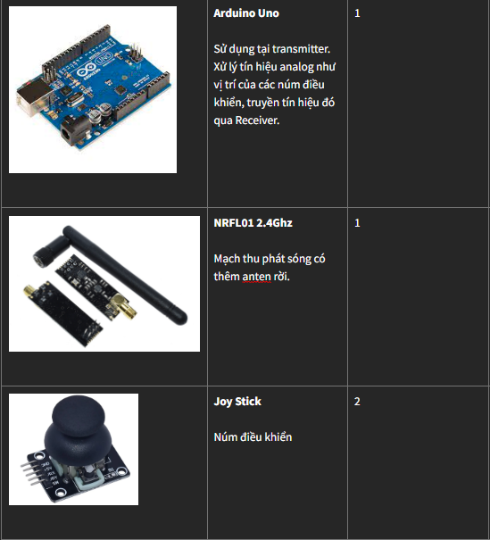

# 1. Nguyên lý và thiết bị

Để điều khiển máy bay, bộ điều khiển cần 2 thiết bị gồm : 
- Transmitter (TX) : Bộ phát sóng, là thiết bị sử dụng điều khiển máy bay.
- Receiver (RX) : Bộ thu sóng đặt trên máy bay. 

Bài viết này mình sẽ hướng dẫn tạo bộ Transmitter và Recevier với Arduino.

## 1.1 Nguyên lý 

- **TX** : Gồm 2 Joy sticks (Núm điều khiển), tín hiệu sẽ được truyền từ Joy Sticks tới Arduino, từ Arduino sẽ truyền thông tin qua mạch Wifi.
- **RX** : Nhận sóng truyền tới, xử lý tại mạch Arduino Nano, sau đó truyền tín hiệu tới Servo, Motor

## 2.2 Thiết bị

**Thiết bị cần cho Transmitter**

**Thiết bị cần cho Receiver**

**Thiết bị điện cho máy bay**

# 2. Nối mạch điện 

## 2.1 Transmitter

*Lưu ý*:
- Mạch wifi sử dụng nguồn 3.3V. Chú ý sử dụng đúng nguồn 3.3V
- Joy stick sử dụng nguồn 5V. 
- Mạch Arduino có thể dùng nguồn 3.3V lấy từ cục xạc dự phòng

## 2.2 Receiver

# 3. Lập trình
Tham khảo bài viết tại đây để biết cách nạp chương trình cho mạch

http://arduino.vn/bai-viet/402-huong-dan-nap-chuong-trinh-don-gian-cho-arduino-uno-r3

## 3.1 Lập trình cho TX

## 3.2 Lập trình cho RX

